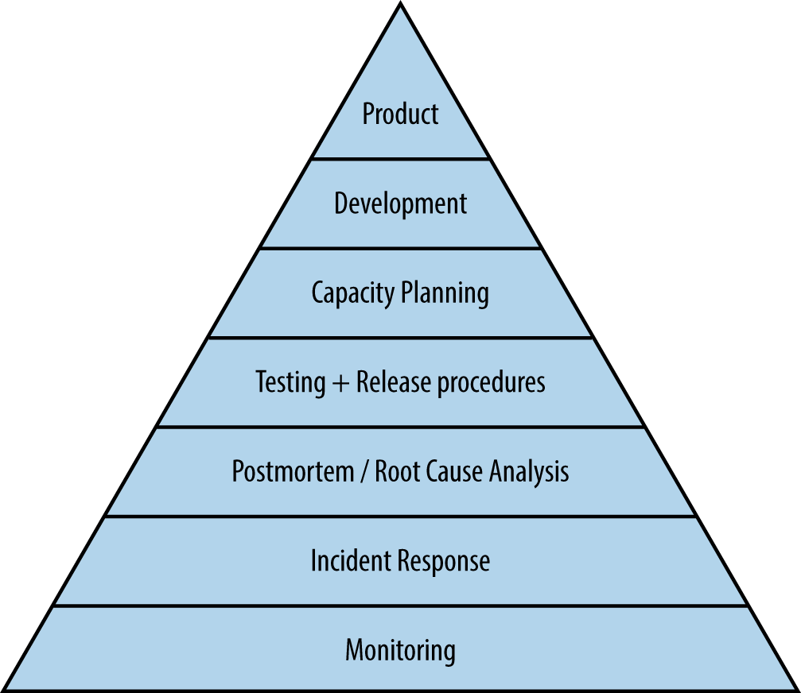

# Site Reliability Engineering

## Practices 

> We can characterize the health of a service—in much the same way that Abraham Maslow categorized human needs [Mas43]—from the most basic requirements needed for a system to function as a service at all to the higher levels of function—permitting self-actualization and taking active control of the direction of the service rather than reactively fighting fires.

Below you'll find the *Hierarchy of Production Needs*:

### Collecting Data

In order to identify the risk tolerance of your consumer services consider the following:

* target level of availability
* types of failures
* cost
* other service metrics

Once appropriate metrics have been identified and agreed upon, consider using an **error budgets**. 

The main benefit of an error budget is that it provides both product development and SREs with a common incentive to find a balance between innovation and reliability.

For example:
A service needs to have 99% availability. Therefore the error budget allows for 1% downtime.

While the system meets this objective, product development can take more risks. However, as the budget is being drained, product developers themselves will add more tests or slow down their velocity to ensure they don't exceed the budget. If the budget is ever exceeded, releases are temporarily halted while additional resources are invested in resilience and performance. 

In this way the error budget helps balance risk with cost.

Be careful when **aggregating raw measurements**. Even for seemingly straightforward metrics like number of requests per second served, incorrect aggregation obscure important information.

> Is the measurement obtained once a second, or by averaging requests over a minute? The latter may hide much higher instantaneous request rates in bursts that last for only a few seconds. Consider a system that serves 200 requests/s in even-numbered seconds, and 0 in the others. It has the same average load as one that serves a constant 100 requests/s, but has an instantaneous load that is twice as large as the average one.

Use percentiles instead - differentiating between the 99th or 99.9th percentile and the 50th percentile will give you detail about both the worst-case scenario and the typical user experience. 

> We generally prefer to work with percentiles rather than the mean (arithmetic average) of a set of values.  Doing so makes it possible to consider the long tail of data points, which often have significantly different (and more interesting) characteristics than the average.  Because of the artificial nature of computing systems, data points are often skewed—for instance, no request can have a response in less than 0 ms, and a timeout at 1,000 ms means that there can be no successful responses with values greater than the timeout. As a result, we cannot assume that the mean and the median are the same—or even close to each other!

### Monitoring

Monitoring is one of the main ways we can track the system's health and availability. 

> Without monitoring, you have no way to tell whether the service is even working; absent a thoughtfully designed monitoring infrastructure, you’re flying blind. Monitoring enables service owners to make rational decisions about the impact of changes to the service, apply the scientific method to incident response, and of course ensure their reason for existence: to measure the service’s alignment with business goals.

### Types of monitoring:

> Monitoring should never require a human to interpret any part of the alerting domain. Instead, software should do the interpreting, and humans should be notified only when they need to take action.

There are three kinds of monitoring:
* alerts - where a human needs to take action immedietly 
* tickets - where a human needs to take action but not immedietly
* logging - useful for diagnostic and forensic purposes

Create alerts on the the the high-level service objectives, but make sure you still have **granular data** to debug and inspect any individual components. 

* white-box monitoring
* black-box monitoring

### Incident Response

### Postmortem and Root-Cause Analysis

> We aim to be alerted on and manually solve only new and exciting problems presented by our service; it’s woefully boring to “fix” the same issue over and over. In fact, this mindset is one of the key differentiators between the SRE philosophy and some more traditional operations-focused environments. 

### Testing

### Capacity Planning

### Development

### Product
